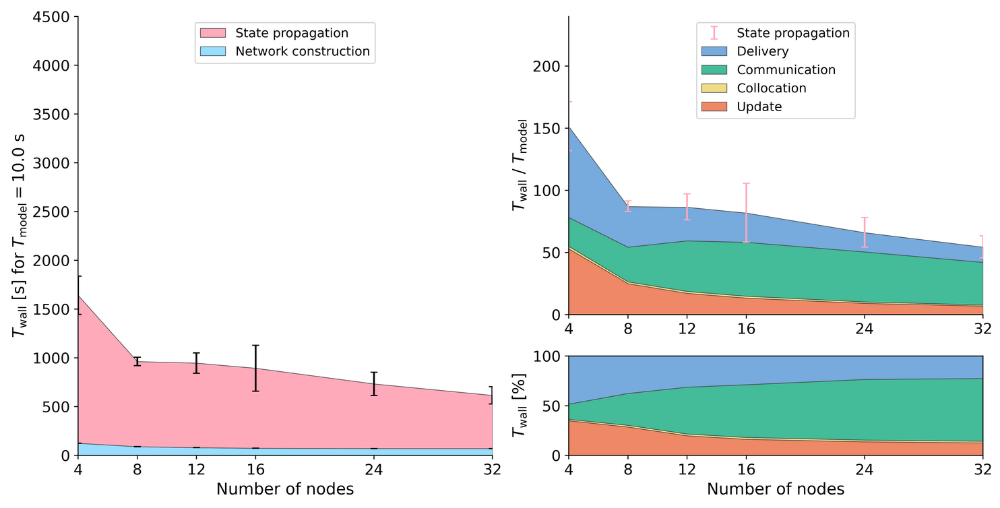

<!-- 
beNNch - Unified execution, collection, analysis and
comparison of neural network simulation benchmarks.
Copyright (C) 2021 Forschungszentrum Juelich GmbH, INM-6

This program is free software: you can redistribute it and/or modify it under
the terms of the GNU General Public License as published by the Free Software
Foundation, either version 3 of the License, or (at your option) any later
version.
This program is distributed in the hope that it will be useful, but WITHOUT ANY
WARRANTY; without even the implied warranty of MERCHANTABILITY or FITNESS FOR A
PARTICULAR PURPOSE. See the GNU General Public License for more details.
You should have received a copy of the GNU General Public License along with
this program. If not, see <https://www.gnu.org/licenses/>.

SPDX-License-Identifier: GPL-3.0-or-later
-->

# beNNch

Computational efficiency is essential to simulate complex neuronal networks and study long-term effects such as learning.
The scaling performance of neuronal network simulators on high-performance computing systems can be assessed with benchmark simulations.
However, maintaining comparability of benchmark results across different systems, software environments, network models, and researchers from potentially different labs poses a challenge.  
**`beNNch` tackles this challenge by implementing a unified, modular workflow for configuring, executing, and analyzing such benchmarks.**  
The software framework builds around the [JUBE Benchmarking Environment](https://www.fz-juelich.de/ias/jsc/EN/Expertise/Support/Software/JUBE/_node.html), installs simulation software, provides an interface to benchmark models, automates data and metadata annotation, and accounts for storage and presentation of results.

For more details on the conceptual ideas behind `beNNch`, refer to our paper:  
> Albers J, Pronold J, Kurth AC, Vennemo SB, Haghighi Mood K, Patronis A, Terhorst D, Jordan J, Kunkel S, Tetzlaff T, Diesmann M and Senk J (2022) A Modular Workflow for Performance Benchmarking of Neuronal Network Simulations. Front. Neuroinform. 16:837549. doi: [10.3389/fninf.2022.837549](https://doi.org/10.3389/fninf.2022.837549)  


***Example `beNNch` output (Figure 5C of Albers et al., 2022):
Strong-scaling performance of the [multi-area model](https://github.com/INM-6/multi-area-model) simulated with the neuronal network simulator [NEST](https://www.nest-simulator.org) on JURECA-DC.**
The left graph shows the absolute wall-clock time measured with Python-level timers for both network construction and state propagation.
Error bars indicate variability across three simulation repeats with different random seeds.
The top right graph displays the real-time factor defined as wall-clock time normalized by the model time.
Built-in timers resolve four different phases of the state propagation: update, collocation, communication, and delivery.
Pink error bars show the same variability of state propagation as the left graph.
The lower right graph shows the relative contribution of these phases to the state-propagation time.*

See also the accompanying [GitHub Page](https://inm-6.github.io/beNNch) for further `beNNch` results in flip-book format.

## Structure

| directory      | description |
|--------   |-------------|
| [analysis](./analysis/)    | scripts for data and metadata analysis |
| [benchmarks](./benchmarks/)  | JUBE benchmark scripts for select neuroscientific models |
| [config](./config/)      | templates for user configuration files to be copied and adapted |
| [flipbook](./flipbook/)    | script for generating a comparative flip book |
| [helpers](./helpers/)     | JUBE helper functions and parameter sets |
| [models](./models/)      | git submodule; the linked repository (`https://github.com/INM-6/beNNch-models`) contains NEST network models adapted to work with `beNNch` |
| [plot](./plot/)        | git submodule; the linked repository (`https://github.com/INM-6/beNNch-plot`) contains predefined plotting routines designed to process the performance results and provide a standardized plotting format |
| [results](./results/)     | git submodule; the repository linked by default (`https://gin.g-node.org/nest/beNNch-results.git`) is private. To see how to change this link to your own results repository, see the optional step in **Initialization**. Make sure your repository works with `git-annex`. |

## User guide

There are two distinct sets of instructions on how to install beNNch:

- the general documentation provided by the [User guide](https://github.com/INM-6/beNNch#user-guide) in this README
- a [walk-through on our GitHub Page](https://inm-6.github.io/beNNch/walk-through.html)

The former is a set of complete, abstract instructions with general placeholders where the user needs to insert information. The latter focuses on a concrete example and guides the reader with screen-shots while discussing small issues and best practices that have emerged when using beNNch in production. Depending on your previous experience you may find one or the other more intuitive. If set-up problems persist after following both approaches, don't hesitate to get into contact via the [Community discussion](https://github.com/INM-6/beNNch#community-discussion).


### Initialization

- Download git submodules:

```bash
git submodule init
```
  + _optional: if you want to change the url of any of the submodules (requires `git v2.25.0`):_  
  `git submodule set-url -- <submodule> <new_url>` 
```bash
git submodule update --remote
```

- Install benchplot as Python module:

```bash
pip install -e plot --user
```
  
### Software dependencies

- [git annex](https://git-annex.branchable.com)
  + can e.g. be installed via 
```bash
wget 'http://downloads.kitenet.net/git-annex/linux/current/git-annex-standalone-amd64.tar.gz'
tar -xzf git-annex-standalone-amd64.tar.gz
export PATH=$PATH:<install_path>/git-annex.linux
```
- [JUBE](https://www.fz-juelich.de/ias/jsc/EN/Expertise/Support/Software/JUBE/_node.html)  
_Note that  JUBE version 2.4.2 or later is necessary_


- [Builder](https://github.com/INM-6/Builder)
  + see Builder documentation for installation guide

- Python 3.X

### Models

For the following network models, there is currently a NEST implementation in the *models* submodule and corresponding JUBE benchmark script in the `benchmarks/` folder:

- **Multi-Area Model**

  - `multi-area-model_2` for usage with NEST 2.
  - `multi-area-model_3` for usage with NEST 3.

- **Microcircuit**

  - `microcircuit`

- **HPC Benchmark**

  - `hpc_benchmark_2` for usage with NEST 2.
  - `hpc_benchmark_3` for usage with NEST 3.0.
  - `hpc_benchmark_31` for usage with NEST 3.1.

### First steps: configure your simulation

Make a copy of the template config file for user parameters and fill it:

```bash
cp config/templates/user_config_template.yaml config/user_config.yaml
```

Copy and fill also the parameter file with model-specific parameters:

```bash
cp config/templates/<model>_config_template.yaml config/<model>_config.yaml
```

In the model config file, you can specify the ```software``` (i.e. the simulator), its ```version```, and a ```variant``` (allowing to install the software with different dependencies) you want to benchmark. For example: `software = nest-simulator`, `version = 3.0`, `variant = gcc9.3`. For convenience, you may also add a ```suffix```.  
To install software for which a plan file does not yet exist (e.g. a new dependency or simulator), you need to configure Builder by adding a ```common``` file explicating the necessary steps of installation that is shared between all variants to

```bash
<path/to/Builder>/plans/<software>/common
```

Note that Builder already provides a `common` file for `nest-simulator`.  
If the `common` file for the simulator or software you wish to install already exists and you only want to add a new version or variant, add both a plan file and a module file template to

```bash
<path/to/Builder>/plans/<software>/<version>/<{variant, variant.module}>
```

In ```variant```, you state the source location of the software as well as the chosen dependencies.
If you use the `module` system for loading dependencies, add the corresponding `module load` commands to this file.
See as an example the ```nest-simulator``` plan files that Builder ships with.  
_Specific to NEST benchmarking: don't forget to include `-Dwith-detailed-timers=ON` in the `CMAKEFLAGS` if you want to have access to C++ level timers._


### Run benchmarks

The JUBE benchmarking scripts can be found in `benchmarks/`.

To run a benchmark, execute:

```bash
jube run benchmarks/<model>.yaml
```

JUBE displays a table summarizing the submitted job(s) and the corresponding `job id`.

### Analyze benchmarks

First, create a new instance of the analysis configuration with
```bash
cp config/templates/analysis_config_template.yaml config/analysis_config.yaml
```
Here, fill in
- whether the scaling benchmark runs across threads or nodes. This sets up a quick, glanceable plot of the benchmark to confirm that no substantial errors occurred. `beNNch` provides defaults for plotting timers across `nodes` and `threads`, but alternatives can be readily implemented by adding to `analysis/plot_helpers.py`.
- the path to the JUBE output (usually the same as the `outpath` of the `<benchmark>` in `benchmarks/<model>`)

To start the analysis, execute
```bash
cd results
```
- _optional: initialize for the first time_
  + `git pull origin main`
  + `git checkout main`
  + `git annex init`
  + `git annex sync`
```bash
python ../analysis/analysis.py <id>
```
where `<id>` is the `job id` of the benchmark you want to analyze.

For sharing, upload the results to the central repository via
```bash
git annex sync
```

### Get remote benchmark results

```bash
cd results
```
- _optional: add a new remote_ 
  + `git add remote <name> <location>`, e.g. `git add remote jureca <username>@jureca.fz-juelich.de:<PATH/TO/REPO>/results`
  + `git fetch <name>`
```bash
git annex get
```

### Visualization

```bash
cd results
```

First, filter which benchmarks to plot using the following syntax:
```bash
git annex view <common_metadata>="<value_of_metadata>" <differing_metadata>="*"
```
Here, `common_metadata` refers to a key that should be the same value for all benchmarks, e.g. the `"machine"`. A list of all available metadata keys can be obtained via `git annex metadata <uuidgen_hash>.csv`. One can use `*` here as well, e.g. when filtering out all runs that include simulations done on 10 nodes via `num_nodes='*,10*'` or all machines that have `jureca` in their name via `machine='*jureca*`. To specify multiple numerical values use `keyword={value1,value2}`.
- example: `git annex view machine="jureca" model_name="microcircuit" nest="*" num_vps="*"`.

Note that this changes the local file structure; the values corresponding to the `<differing_metadata>` determine the names of the folders in a hierarchical fashion. In the example above, the top level would consist of folders named after the values of `nest` (e.g. `nest-simulator/2.14.1`, `nest-simulator/2.20.2` and `nest-simulator/3.1`), with each of those containing folders named after the number of virtual processes of the simulations (e.g. `4`, `8`, `16`). Rearranging the order of `<differing_metadata>` in the command above also reorders the hierarchical file structure.
To "go back" a view, execute
```bash
git annex vpop
```
After choosing which benchmarks to display via filtering above and ordering them via `<differing_metadata>`, you can create a flip book of all plots with
```bash
python ../flipbook/flipbook.py <scaling_type> <bullet_1> <bullet_2> ...
```
with an arbitrarily long list of bullet items (consisting of metadata keys) that appear as bullet points on the slides for comparison. `<scaling_type>` defines the style of plotting, c.f. section on [Analyze Benchmarks](#analyze-benchmarks).

### Known issues
- error `jinja2.exceptions.TemplateNotFound: index.html.j2`
  + [issue](https://github.com/jupyter/nbconvert/issues/1394) with a recent version of `nbconvert`, try to install version `5.6.1` instead (e.g. `pip install nbconvert==5.6.1 --user`)

### Community discussion

We organize a discussion with a focus on both community usage and development synchronization. For details regarding space-time coordinates, contact [Jasper Albers](mailto:j.albers@fz-juelich.de?subject=[beNNch]%20Community%20Discussion%20Meeting).

___
## Developer guide

### Add a new model

`benchmarks/template.yaml` provides a template for a JUBE benchmarking script and can be used as a starting point for adding a new model. Here, only the marked section needs to be adapted. As a reference, see the implementation of the microcircuit in `benchmarks/microcircuit.yaml`.

In addition, minor modifications to a regular network model need to be made in order to comply with `beNNch`'s standards. In particular, this concerns how JUBE feeds the configuration parameters to the network and how JUBE reads the performance measurement output.

#### Input

A new model needs to be able to receive input from JUBE for setting parameters. Following the `substituteset` defined in `benchmarks/template.yaml`, all listed source keys need to be initialized. In addition, the corresponding target keys need to be defined in a config file. Use `models/Potjans_2014/run_bm_microcircuit.py` for the former and `config/templates/microcircuit_config_template.yaml` as a reference.

#### Output

As current releases of NEST (including 2.14.1, 2.20.2 and 3.0+) include timers on the C++ level for measuring the simulation performance, the model only needs to output this information in a way compliant with `beNNch`. This can be done via adding a call to the `logging` function defined in `models/Potjans_2014/bm_helpers.py`. Note that this also provides the optional functionality to include python level timers as well as memory information.

## How to cite beNNch

Please cite our paper:  
> Albers J, Pronold J, Kurth AC, Vennemo SB, Haghighi Mood K, Patronis A, Terhorst D, Jordan J, Kunkel S, Tetzlaff T, Diesmann M and Senk J (2022) A Modular Workflow for Performance Benchmarking of Neuronal Network Simulations. Front. Neuroinform. 16:837549. doi: [10.3389/fninf.2022.837549](https://doi.org/10.3389/fninf.2022.837549)

To refer to a specific version of beNNch, name the release or provide a link to this repository with the hash of the respective commit.
