<!-- 
beNNch - Unified execution, collection, analysis and
comparison of neural network simulation benchmarks.
Copyright (C) 2021 Forschungszentrum Juelich GmbH, INM-6

This program is free software: you can redistribute it and/or modify it under
the terms of the GNU General Public License as published by the Free Software
Foundation, either version 3 of the License, or (at your option) any later
version.
This program is distributed in the hope that it will be useful, but WITHOUT ANY
WARRANTY; without even the implied warranty of MERCHANTABILITY or FITNESS FOR A
PARTICULAR PURPOSE. See the GNU General Public License for more details.
You should have received a copy of the GNU General Public License along with
this program. If not, see <https://www.gnu.org/licenses/>.

SPDX-License-Identifier: GPL-3.0-or-later
-->

# Walk-through of using beNNch

This guide serves to illustrate an example walk-through of a typical beNNch use case. Where the README in the repository is designed to be generally applicable, this guide is created to be explicit and walk through a concrete example.

## Prerequisites

### Step 0: Install NEST as a module with Builder

Install [Builder](https://github.com/INM-6/Builder) as per instructions in the README. In practice, one often isn't concerned with testing each nest installation. In case you are confident that these tests are unnecessary, you can skip them by commenting out `build_install_test` at the end of `build.sh`, speeding up the installation process significantly.  
Builder works with so-called plan files. A few sample files for different NEST versions are provided by Builder in `Builder/plans/nest-simulator/`. If you want to create a new installation, follow these steps:

#### Step 0.1: Create new plan file
Duplicate the folder of the NEST version that is closest to the one you want to install. For example, if you want to install NEST 3.3, duplicate the folder for NEST 3.0 and change the name. Note that the name does not need to correspond to an official release.

#### Step 0.2: Select version to install
Change the URL in `Builder/plans/nest-simulator/<your_new_version>/default` to where the source code can be found. If you want to test a custom NEST version that lives on your own branch, you can specify the link to the zip file (go to your branch, click on "Code", and right-click "Download ZIP" to obtain the link).

#### Step 0.3: Installation options
Configure cmake flags for the installation by introducing a new variable in `Builder/plans/nest-simulator/<your_new_version>/default`:

```
CONFIGURE_OPTIONS+=" -Dwith-mpi=ON -Dwith-ltdl=OFF -DCMAKE_CXX_COMPILER=g++-11 -DCMAKE_C_COMPILER=gcc-11 -Dwith-boost=ON"
```
Note that these are example values; check the [NEST documentation](https://nest-simulator.readthedocs.io/en/stable/installation/cmake_options.html) on which options exist.

#### Step 0.4: Build NEST
Build NEST by executing `build nest-simulator <your_new_version>`.

#### Step 0.5: Load NEST as a module
You should be able to load NEST via `module load nest-simulator/<your_new_version>`. If your module system isn't able to locate the NEST module, you might need to add the path to your modules (the one you specified during the Builder setup in `~/.buildrc`) to your MODULEPATH by adding 
```
export MODULEPATH="<your_module_path>:$MODULEPATH"
```
to your `.bashrc`/`.zshrc`.

## Configuration

### Step 1: Configuring the benchmark
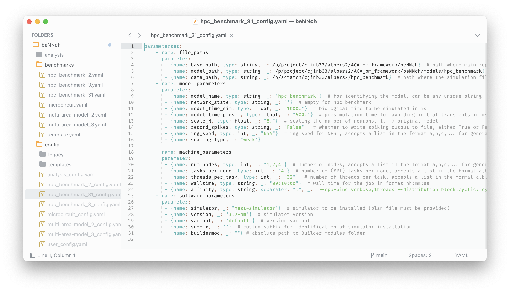

Open `./config/` and select the benchmark you want to execute. In the corresponding config file (here: `hpc_benchmark_31_config.yaml`) you can choose the parameters that define the benchmark such as the model parameters and the machine parameters. Note that lists are supported for exploring parameter spaces (here: see the list `1,2,4` in line 20 --- this will create a job for each element in the list, thus running a scaling experiment across nodes).  
For using the backend simulator, beNNch is based on the module system. This means that beNNch expects the simulator to be loadable via the following command:
```bash
module load <simulator>/<version>/<variant>
```
which in our case is
```bash
module load nest-simulator/3.2-bm/default
```

See the section ["First steps: configure your simulation" of the beNNch README](https://github.com/INM-6/beNNch#first-steps-configure-your-simulation) on how to install a simulator such that it is `module load`able using Builder, or Step 0 in this guide for a specific example of installing NEST in such a way.


## Simulation

### Step 2: Run simulations
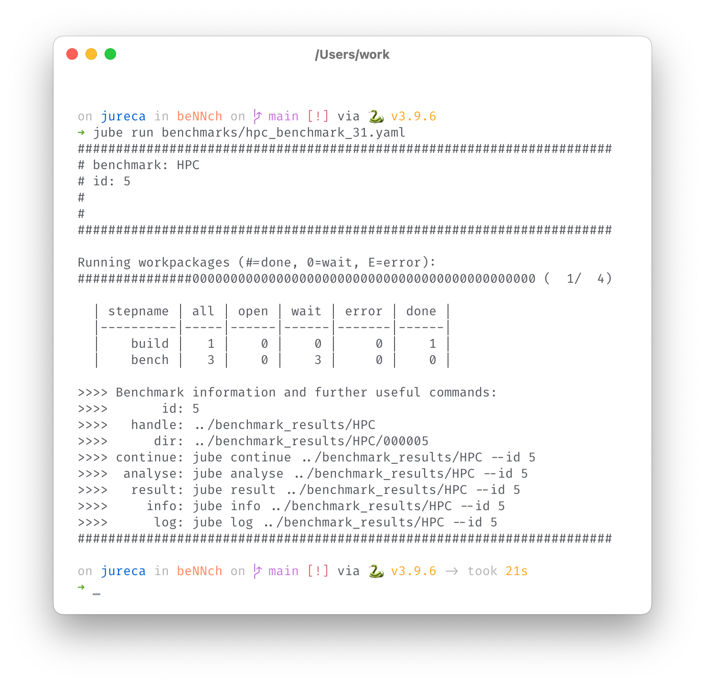

Executing the benchmark file that corresponds to the config file we just edited (here: `benchmarks/hpc_benchmark_31.yaml`) submits the jobs to the scheduler and displays them in a table. The build job will check whether the underlying simulator (here: nest-simulator) is already installed, and if not, install it using Builder. The bench jobs are the actual simulation runs; here we created three runs since we gave a list of nodes in the config file.
This overview also displays the id of the job, telling you where the results can be found.

### Step 3: Inspect running jobs
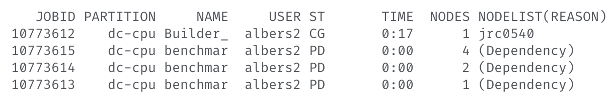

The jobs are submitted with a dependency: first, the build job finishes; afterwards, the simulation jobs run.

### Step 4: Simulation output files --- location
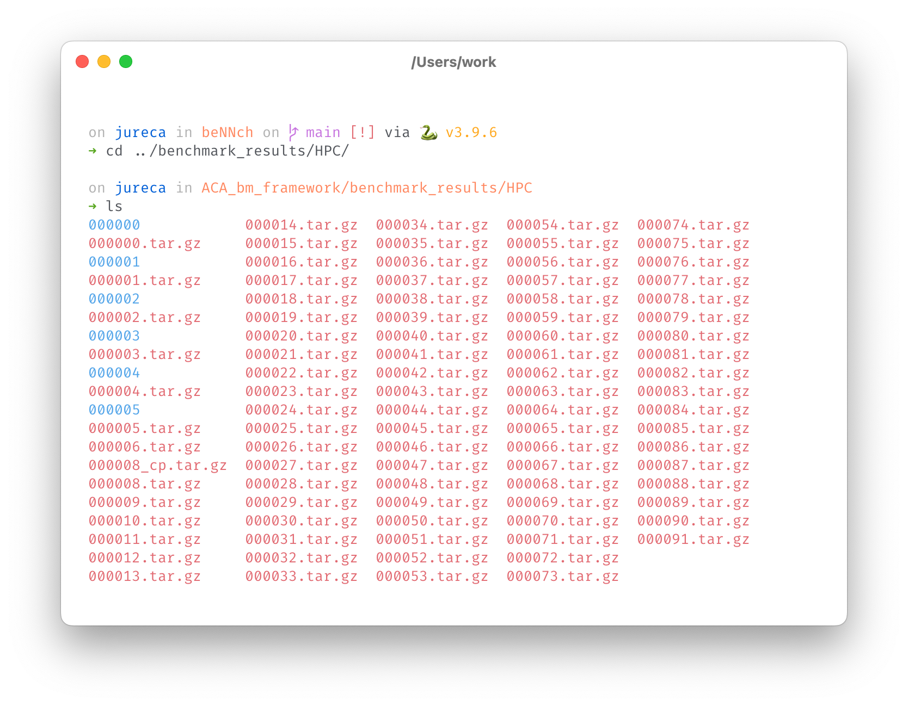

Here you can see that JUBE creates a folder for the experiment, indexed with the id of the job: `000005` (the other folders are from different experiments). The default location is `../benchmark_results/HPC` for the hpc_benchmark model, but this can be changed in `benchmarks/hpc_benchmark_31.yaml` under `outpath`.

### Step 5: Simulation output files --- content
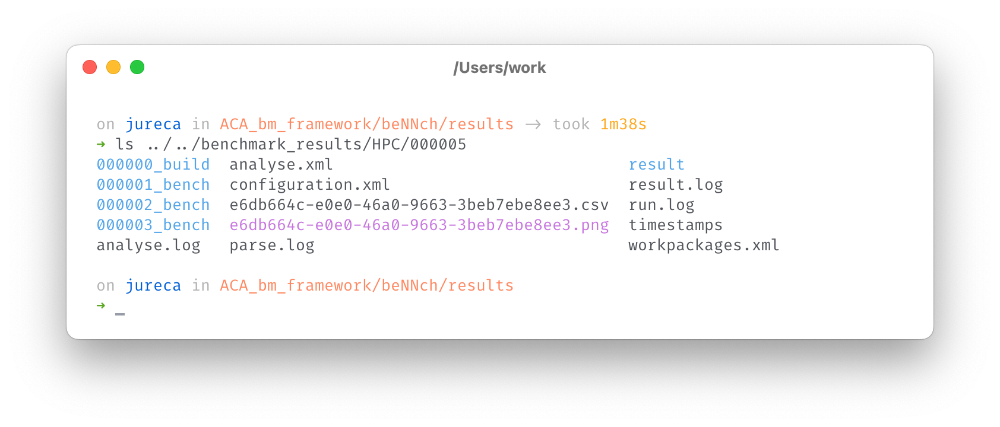

Looking at the created files, we see folders of the individual jobs that constitute the experiment containing the individual simulation results, and the summarized timing results in `<hash>.csv` as well as a first plot of the results in `<hash>.png`. Here, `<hash>` is a randomly created `uuidgen` with no internal meaning.

## Analysis

### Step 6: Where to store results
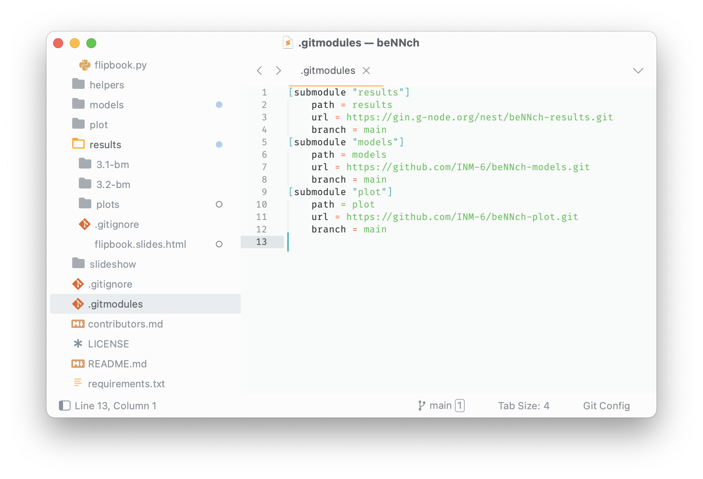

By default, the results are stored in the following gin repository: `https://gin.g-node.org/nest/beNNch-results.git`. If you want to exchange this for your own destination, you can follow the optional step in the initialization procedure: 

```bash
git submodule set-url -- results <new_url>
```

### Step 7: Analysis config
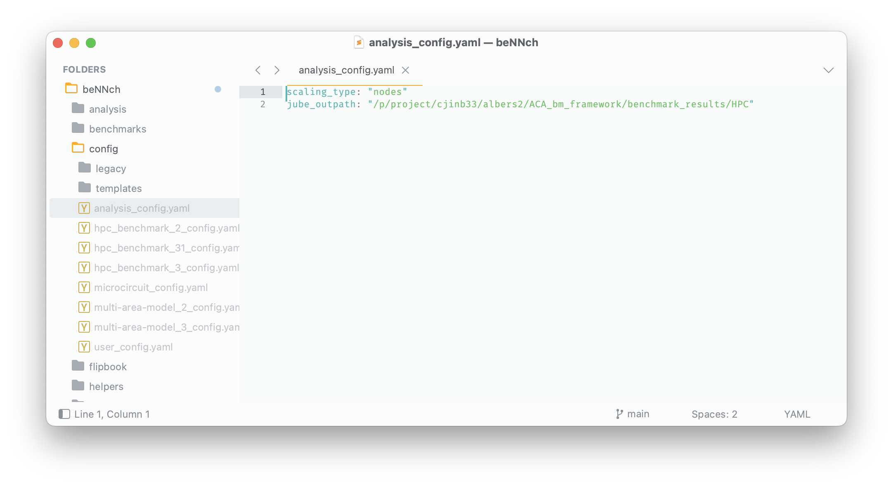

Before running the analysis, we need to set the `scaling_type` for plotting either across `threads` or `nodes` and the outpath defined in `benchmarks/hpc_benchmark_31.yaml`. This information is typically similar across different experiments of the same model, therefore we store it in this file and don't have to provide it everytime we want to analyze.

### Step 8: Run analysis
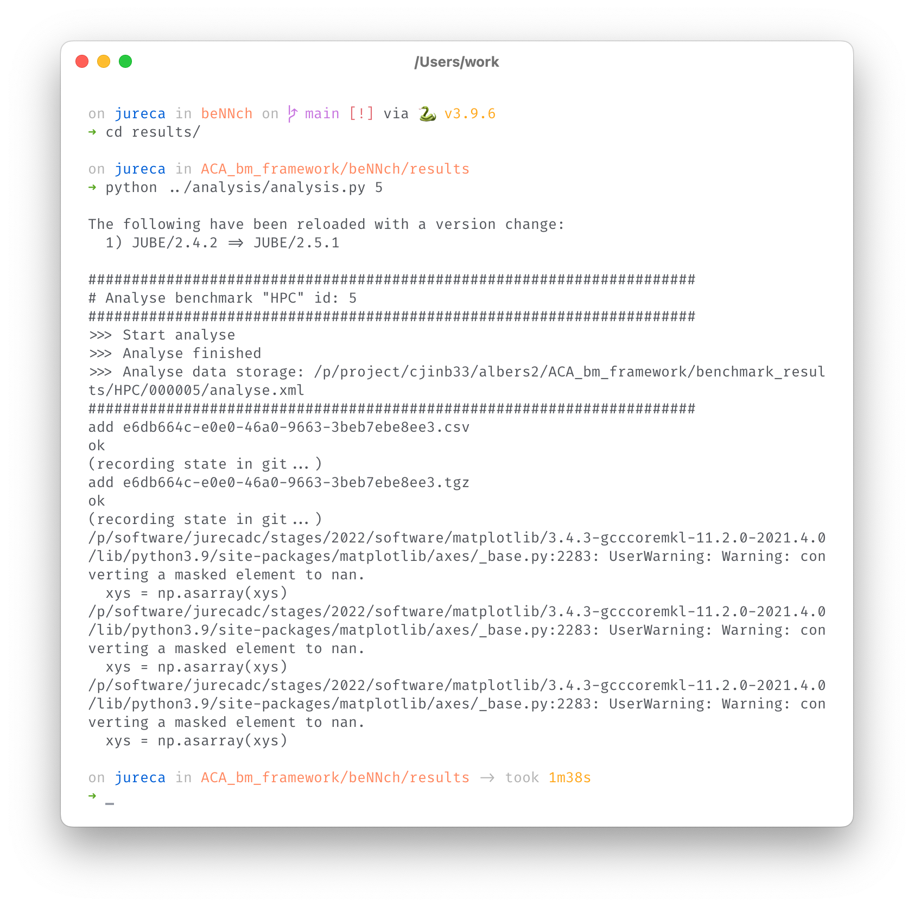

The analysis config makes our analysis command very simple: after changing to the `results/` directory, we only need to provide the id of the experiment.

## Results

### Step 9: Inspect results
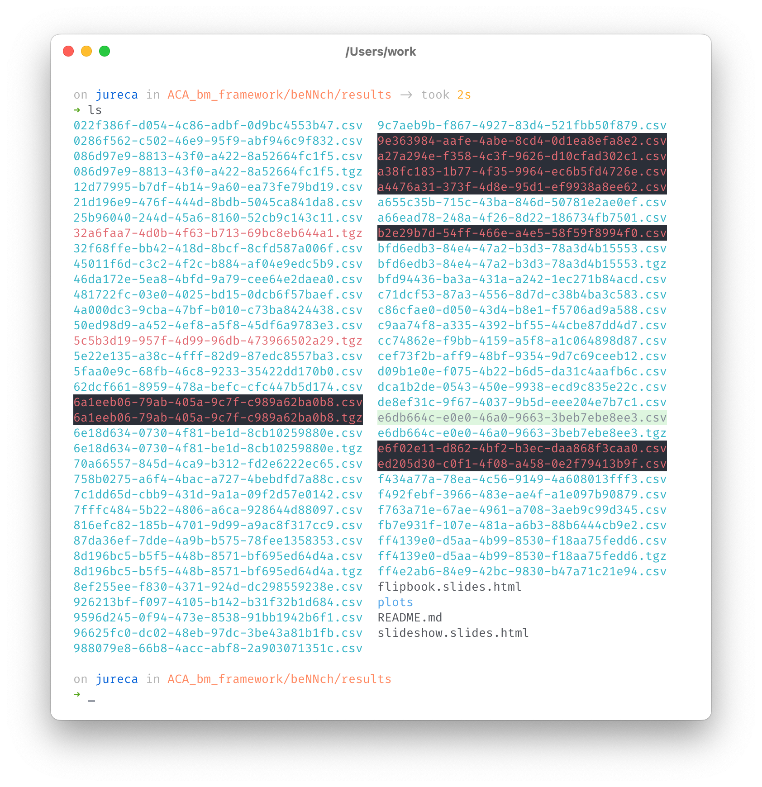

We see that the output file containing the summarized timing information is added to the `results/` directory (here highlighted in light green).

### Step 10: Sync results
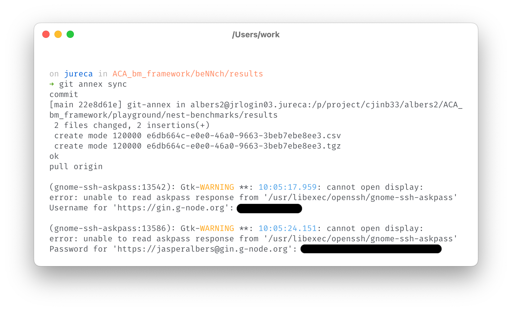

Next, we need to sync the repository in order to add the new results.

### Step 11: Sort and filter results
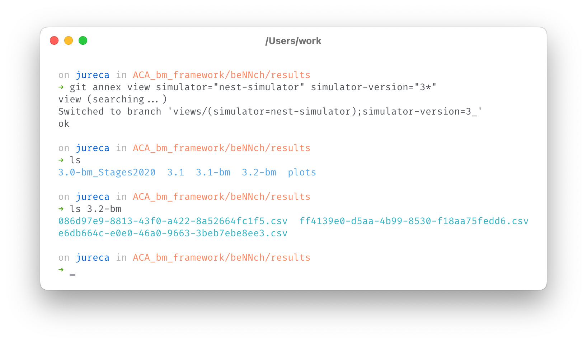

One of the key features of beNNch is the metadata tracking. This allows us to not have to worry about what the hashes in the list of Step 10 mean; we can simply choose the results we want to inspect by their metadata. Technically this is achieved through `git annex view`. In this example, we want to select for benchmarks that are run with the `nest-simulator` as backend and use the wildcard `*` operator to select runs where the `simulator-version` starts with a `3`.  
In `git annex view`s, the wildcard operator has an additional function: it sorts the results into folders for each metadata key, where `*` appears as the desired value. This is visible in the resulting folder hierarchy, where the folders `3.0-bm_Stages2020`, `3.1`, `3.1-bm` and `3.2-bm` are created. Inside of these folders lie the respective benchmark results (see the output of the `ls` command). Note that this functionality works on arbitrarily many levels: if we added `machine="*"` to the list of key-value pairs, each folder would contain subfolders with all existing machine names.

## Presentation

### Step 12: Create flipbook
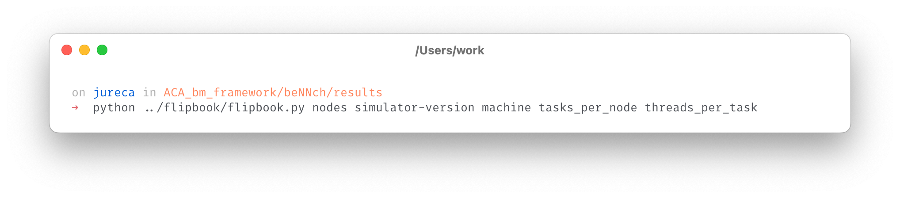

After selecting the benchmarks of interest, we can create a presentation of the results in a flip-book format. For this, we execute the command above.

### Step 13: View flipbook
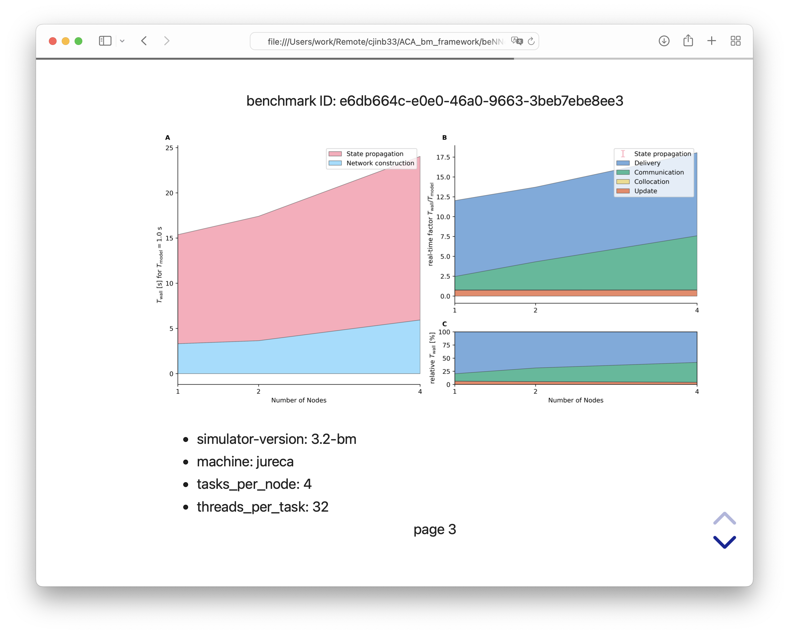

Finally, we are able to flick through the various benchmark results.
